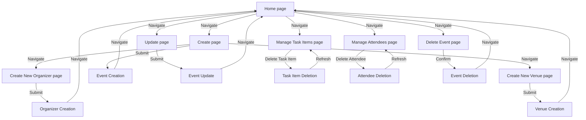

```mermaid
flowchart TD
    HomePage["Home page"] --> |Navigate| CreatePage["Create page"]
    CreatePage --> |Navigate| CreateNewOrganizer["Create New Organizer page"]
    CreatePage --> |Navigate| CreateNewVenue["Create New Venue page"]
    CreatePage --> |Submit| EventCreation["Event Creation"]
    EventCreation --> |Navigate| HomePage["Home page"]
    CreateNewOrganizer --> |Submit| OrganizerCreation["Organizer Creation"]
    OrganizerCreation --> |Navigate| HomePage["Home page"]
    CreateNewVenue --> |Submit| VenueCreation["Venue Creation"]
    VenueCreation --> |Navigate| HomePage["Home page"]
    HomePage --> |Navigate| UpdatePage["Update page"]
    HomePage --> |Navigate| ManageTaskItemsPage["Manage Task Items page"]
    HomePage --> |Navigate| ManageAttendeesPage["Manage Attendees page"]
    HomePage --> |Navigate| DeleteEventPage["Delete Event page"]
    UpdatePage --> |Submit| EventUpdate["Event Update"]
    EventUpdate --> |Navigate| HomePage["Home page"]
    ManageTaskItemsPage --> |Delete Task Item| TaskItemDeletion["Task Item Deletion"]
    TaskItemDeletion --> |Refresh| ManageTaskItemsPage["Manage Task Items page"]
    ManageAttendeesPage --> |Delete Attendee| AttendeeDeletion["Attendee Deletion"]
    AttendeeDeletion --> |Refresh| ManageAttendeesPage["Manage Attendees page"]
    DeleteEventPage --> |Confirm| EventDeletion["Event Deletion"]
    EventDeletion --> |Navigate| HomePage["Home page"]
```
